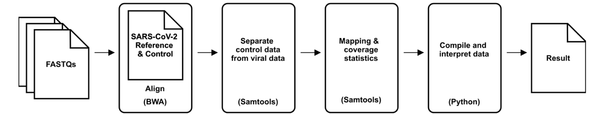

# Bioinformatics Evaluation of Assembly and Resequencing (BEAR) Pipeline for the POLAR Test Kit: SARS-CoV-2 for Illumina®

# Contents
* [Installation](#installation)
   * [Install POLAR-BEAR-EUA and requirements manually](#install-polar-and-requirements-manually)
   * [Install POLAR-BEAR-EUA with installation script](#install-polar-with-installation-script)
   * [Install using an existing Conda installation](#install-using-an-existing-conda-installation)
* [Detailed Guide](#detailed-guide)
   * [Usage and options](#usage-and-options)
   * [Repository](#repository)
   * [Setup and output folders](#setup-and-output-folders)
* [Contributing](#contributing)

# Installation

The Polar pipeline and all its dependencies are Linux based, typically running under Linux
operating system, preferably (but not necessarily) on a computer cluster. The included test
set can run on a laptop in under 5 minutes. There are several options for installation, detailed below.

## Install Polar and requirements manually

You can install the POLAR-BEAR-EUA pipeline and all its dependencies manually.

1. Install the following dependencies:

    * [BWA](https://github.com/lh3/bwa)
    * [Samtools](http://www.htslib.org/download)
    * [Argparse](https://pypi.org/project/argparse/)
    * [Python](https://www.python.org/downloads/)
    * [Pandas](https://github.com/pandas-dev/pandas)

2. Clone or download the repository form Github

        git clone https://github.com/aidenlab/POLAR-BEAR.git --branch eua POLAR-BEAR-EUA

        or...

        curl -sSL -o POLAR-BEAR-EUA.zip https://github.com/aidenlab/POLAR-BEAR/archive/eua.zip
        mkdir -p POLAR-BEAR-EUA
        unzip POLAR-BEAR-EUA.zip -d POLAR-BEAR-EUA

3. Run the test

        cd POLAR-BEAR-EUA/test
        ../run_polar_bear_eua_pipline.sh

## Install using an existing Conda installation
If you already have a Anaconda/Miniconda installation then you can create a conda environment using the provided environment definition.

1. Clone or download the Polar pipeline

        git clone https://github.com/aidenlab/POLAR-BEAR.git --branch eua POLAR-BEAR-EUA

        or...

        curl -sSL -o POLAR-BEAR-EUA.zip https://github.com/aidenlab/POLAR-BEAR/archive/eua.zip
        mkdir -p POLAR-BEAR-EUA
        unzip POLAR-BEAR-EUA.zip -d POLAR-BEAR-EUA

2. Create the conda environment

        conda env create -n polar_eua_conda_env -f POLAR-BEAR-EUA/polar_eua_conda_env.yml

3. Activate the conda environment and run the test

        conda activate polar_eua_conda_env    
        cd POLAR-BEAR-EUA/test
        ../run_polar_bear_eua_pipline.sh
        conda deactivate

# Detailed Guide
Polar is the viral diagnostic pipeline, currently designed for SARS-Cov-2. For more information, see the paper: https://www.biorxiv.org/content/10.1101/2020.04.25.061499v1

The pipeline takes as input paired-end sequencing reads and creates as output a PDF with the result of the test for the virus (positive or negative). The PDF also includes other qualitative and quantitative measures, detailed below.

The pipeline first aligns the reads to a database of betacoronaviruses (performed in parallel). Separately, it creates contigs from the reads. This contigged assembly is then pairwise aligned to SARS-CoV-2.

Breadth of coverage statistics and coverage data are gathered after alignment is complete. Custom Python code creates a dotplot showing the quality of the de novo assembly to the match viral genome (SARS-CoV-2), breadth of coverage, and bar plots indicating the breadth of coverage percentage of the reads to the database of related viral genomes.

## Usage and options

    Usage: run_polar_bear_eua_pipline.sh [-d TOP_DIR] [-t THREADS] -h
            -d  Top level directory which must contain a subdirectory (fastq/) with fastq files
            -t  Number of threads for BWA alignment (Default: 16)
            -s  Sample sheet with index IDs
            -h  Print this help and exit

## Setup and output folders

Place the paired end sequenced reads in a folder labeled `fastq`.
For example, if your experiment is called "Library1", you should have
a folder labeled "Library1" and it should contain one subfolder labeled
"fastq" with the fastq files in it.The fastqs can be zipped or unzipped, and there can be multiple pairs.

The pipeline will create folders work folder called "polar-bear-fda-eua" under "Library1". In addtion, the piplinee will create sub-folders called "aligned" and "debug" under the "polar-bear-fda-eua" folder. The "final" folder will contain the diagnsotic result from "Library1" in a CSV file called result.csv.

# Contributing

We welcome contributions! Please have a look [here](CONTRIBUTING.md) on how you can help.
