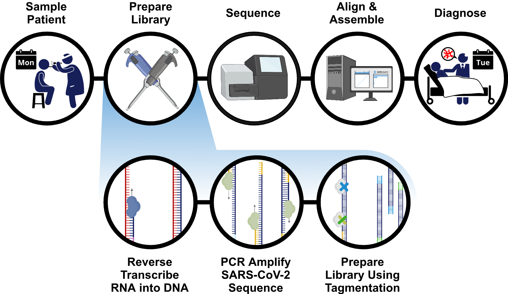
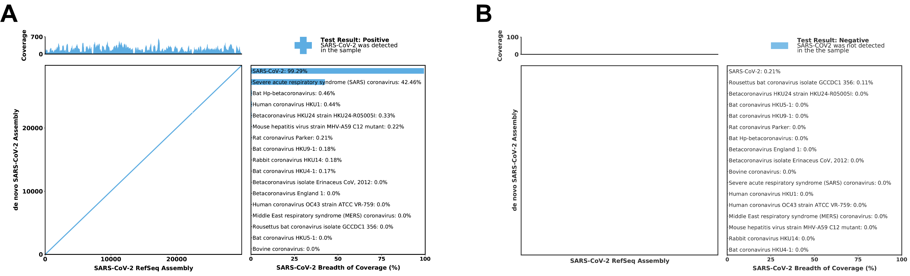

# Pipeline for Polar: viral diagnostic for SARS-CoV-2


# 
* [Installation](#installation)
   * [Install Polar and requirements manually](#install-polar-and-requirements-manually)
   * [Install Polar with installation script](#install-polar-with-installation-script)
   * [Install using an existing Conda installation](#install-using-an-existing-conda-installation)
   * [Running Polar with Docker/Singularity](#running-polar-with-dockersingularity)
   * [Running Polar on a single machine](#running-polar-on-a-single-machine)
   * [Running Polar on SLURM](#running-polar-on-slurm)
* [Detailed Guide](#detailed-guide)
   * [Usage and options](#usage-and-options)
   * [Repository](#repository)
   * [Setup and output folders](#setup-and-output-folders)
* [Contributing](#contributing)

# Installation

The Polar pipeline and all its dependencies are Linux based, typically running under Linux 
operating system, preferably (but not necessarily) on a computer cluster. The included test 
set can run on a laptop in under 5 minutes. There are several options for installation, detailed below.

## Install Polar and requirements manually

You can install the Polar pipeline and all its dependencies manually.

1. Install the dependencies:

    * [BWA](https://github.com/lh3/bwa)
    * [Samtools](http://www.htslib.org/download)
    * [Minimap2](https://github.com/lh3/minimap2)
    * [MEGAHIT](https://github.com/voutcn/megahit)
    * [SciPy](https://www.scipy.org/install.html)
    * [Argparse](https://pypi.org/project/argparse/)
    * [Python](https://www.python.org/downloads/)
    * [Numpy](https://github.com/numpy/numpy)
    * [Matplotlib](https://github.com/matplotlib/matplotlib)
    * [Pandas](https://github.com/pandas-dev/pandas)

2. Clone or download the repository form Github

        git clone https://github.com/aidenlab/Polar.git

    or

        curl -sSL -o Polar.zip https://github.com/aidenlab/Polar/archive/master.zip
        mkdir -p Polar
        unzip Polar.zip -d Polar

3. Run the test

        cd Polar/test
        ../align_serial.sh

## Install Polar with installation script

You can install the Polar pipeline and all its dependencies in one go with a provided bash script, [Prepare_Polar_Conda_Env.sh](https://github.com/aidenlab/Polar/blob/master/Prepare_Polar_Conda_Env.sh) .

The script performs the following:

* Installs Miniconda3
* Installs Polar from Github
* Creates a conda environment with all the dependencies
* Runs a test scenario

If the script is called without any parameters it will create two directories, `Polar` and `miniconda3_polar` in the current folder for the pipeline and the Miniconda installation. Calling with a parameter will install at the specified location. 

The following example will install Polar pipeline in `Polar_install` folder under the home directory.

    curl -sl https://raw.githubusercontent.com/aidenlab/Polar/master/Prepare_Polar_Conda_Env.sh?token=AID67XLJCB6IR2322CZNQYS6UUJX4 | bash -s -- ~/Polar_install

Calling the pipeline then will require initializing the conda environment first:

    source ~/Polar_install/miniconda3_polar/etc/profile.d/conda.sh
    conda activate Polar_conda_env
    ~/Polar_install/Polar/align_serial.sh -h
    ...
    conda deactivate

## Install using an existing Conda installation

If you already have a Anaconda/Miniconda installation then you can create a conda environment using the provided environment definition.

1. Clone or download the Polar pipeline

        git clone https://github.com/aidenlab/Polar.git

2. Create the conda environment

        conda env create -n Polar_conda_env -f ./Polar/Polar_conda_env.yml

3. Activate the conda environment and execute a Polar test

        conda activate Polar_conda_env    
        cd ./Polar/test
        ../align_serial.sh
        conda deactivate

## Running Polar with Docker/Singularity

Running the Polar pipeline with the provided test using Docker

    docker run -rm aidenlab/polar:latest -d /tmp/test

or with Singularity (we clone the repository only for the test data)

    git clone https://github.com/aidenlab/Polar.git
    singularity run docker://aidenlab/polar:latest --pwd /fastq -B ./Polar/test:/fastq

## Running Polar on SLURM

1. Ensure you have installed required software.
2. Clone repository
```bash

      git clone https://github.com/aidenlab/Polar.git
```
3. Modify the variables at the top of align_slurm.sh to
   correspond to your system's load, commands, and queues.
4. Run test
```bash

      cd Polar/test
      ../align_slurm.sh
```

Systems vary in their resources but we have tried our best to make it 
easy to modify the SLURM script to fit your system. Modify the variables
at the top of the script to work with your system. For example, you can 
modify "LOAD_BWA" so that it loads the appropriate module, or exports
the appropriate path. You can also modify the call "BWA_CMD" to be the
full path to the executable.

## Running Polar on a single machine 

1. Install required software
2. Clone repository
      `git clone https://github.com/aidenlab/Polar.git`

3. Run test
```bash
      cd Polar/test
      ../align_serial.sh
```

# Detailed Guide

Polar is the viral diagnostic pipeline, currently designed
for SARS-Cov-2. For more information on the protocol, see
our paper here:

The pipeline takes as input paired-end sequencing reads
and creates as output a PDF with the result of the test for the virus
(positive or negative). The PDF also includes other qualitative and 
quantitative measures, detailed below.


The pipeline first aligns the reads to a database of betacoronaviruses 
(performed in parallel). Separately, it creates contigs from the
reads. This contigged assembly is then pairwise aligned to SARS-CoV-2.

Breadth of coverage statistics and coverage data are gathered after alignment is complete.
Custom Python code creates a dotplot showing the quality of the de novo
assembly to the match viral genome (SARS-CoV-2), breadth of coverage, and
bar plots indicating the breadth of coverage percentage of the reads to the 
database of related viral genomes.

## Usage and options
```
Usage: align_serial.sh [-d TOP_DIR] [-t THREADS] -jkrh
* [TOP_DIR] is the top level directory (default $(pwd))
  [TOP_DIR]/fastq must contain the fastq files
* [THREADS] is number of threads for BWA alignment
* -j produce index file for aligned files
* -k start pipeline after all alignments have finished
* -r reduced set for alignment
* -h: print this help and exit
```

For debugging, you can have the pipeline create indices of the aligned bam
files; pass in the `-j` flag to enable this option.

For quicker processing, you can choose to align to a reduced set that includes
only the "match" and "close" genomes; pass in the `-r` flag to enable this option.

Send in the number of threads you wish to use for BWA alignment via `-t threads`.

## Repository

The Polar code can be found at https://github.com/aidenlab/Polar.git

The repository contains the viral genomes to test against in the folder
`betacoronaviruses`. The subfolder `match` contains the viral genome
we are testing against (SARS-CoV-2). The subfolder `close`
contains the genomes phylogentically most closely related to the `match`
genome. The subfolder `far` contains other related genomes. 

## Setup and output folders

Place the paired end sequenced reads in a folder labeled `fastq`.
For example, if your experiment is called "Library1", you should have
a folder labeled "Library1" and it should contain one subfolder labeled
"fastq" with the fastq files in it.

The fastqs can be zipped or unzipped, and there can be multiple pairs.

The pipeline will create folders "work", "log", and "final" under "Library1".
The "final" folder will contain the assembly fasta and the PDF report. Below 
are examples of a positive report (A) and a negative report (B). 




# Contributing

We welcome contributions! Please have a look [here](CONTRIBUTING.md) on how you can help.
