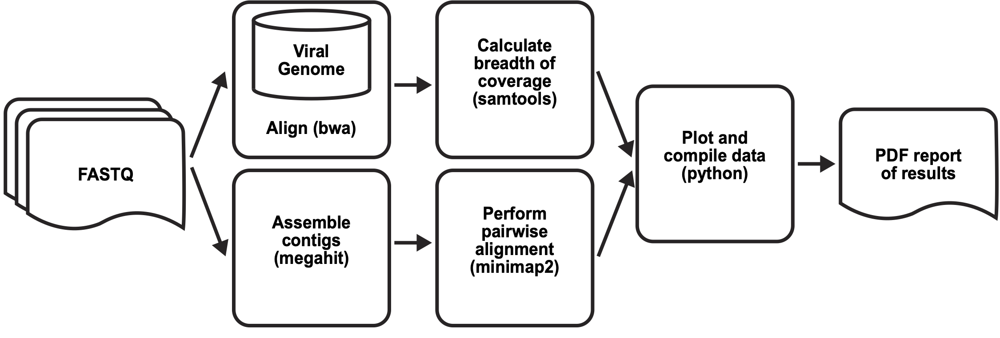

# Pipeline for Polar: viral diagnostic for SARS-CoV-2


## Requirements
Polar can be run on a SLURM cluster or on a single machine.
In either case, you must install the following required software:

* [BWA](https://github.com/lh3/bwa)
* [Samtools](http://www.htslib.org/download)
* [Minimap2](https://github.com/lh3/minimap2)
* [MEGAHIT](https://github.com/voutcn/megahit)
* [SciPy] (https://www.scipy.org/install.html)
* [Argparse] (https://pypi.org/project/argparse/)

## Single Machine Quick Start

1. Install required software
2. Clone repository
      `git clone https://github.com/aidenlab/Polar.git`

3. Run test
```bash
      cd Polar/test
      ../align_serial.sh
```

## SLURM Quick Start

1. Ensure you have installed required software.
2. Clone repository
```bash

      git clone https://github.com/aidenlab/Polar.git
```
3. Modify the variables at the top of align_slurm.sh to
   correspond to your system's load, commands, and queues.
4. Run test
```bash

      cd Polar/test
      ../align_serial.sh
```

# Detailed Guide

Polar is the viral diagnostic pipeline, currently designed
for SARS-Cov-2. For more information on the protocol, see
our paper here:

The pipeline takes as input paired-end sequencing reads
and creates as output a PDF with the result of the test for the virus
(positive or negative). The PDF also includes other qualitative and 
quantitative measures, detailed below.



The pipeline first aligns the reads to a database of betacoronaviruses 
(performed in parallel on SLURM). Separately, it creates contigs from the
reads. This contigged assembly is then pairwise aligned to SARS-CoV-2.

Mapping statistics and coverage data are gathered after alignment is complete.
Custom Python code creates a dotplot showing the quality of the de novo
assembly to the match viral genome (SARS-CoV-2), depth of coverage, and
bar plots indicating the mapping percentage of the reads to the database of related viral genomes.

## Usage and options
```
Usage: align_serial.sh [-d TOP_DIR] [-t THREADS] -jrh
* [TOP_DIR] is the top level directory (default $(pwd))
  [TOP_DIR]/fastq must contain the fastq files
* [THREADS] is number of threads for BWA alignment
* -j produce index file for aligned files
* -r reduced set for alignment
* -h: print this help and exit
```

For debugging, you can have the pipeline create indices of the aligned bam
files; pass in the `-j` flag to enable this option.

For quicker processing, you can choose to align to a reduced set that includes
only the "match" and "close" genomes; pass in the `-r` flag to enable this option.

Send in the number of threads you wish to use for BWA alignment via `-t threads`.

## Repository

The Polar code can be found at https://github.com/aidenlab/Polar.git

The repository contains the viral genomes to test against in the folder
`betacoronaviruses`. The subfolder `match` contains the viral genome
we are testing against (currently SARS-CoV-2). The subfolder `close`
contains the genomes phylogentically most closely related to the `match`
genome. The subfolder `far` contains other related genomes. 

## Setup and output folders

Place the paired end sequenced reads in a folder labeled `fastq`.
For example, if your experiment is called "Library1", you should have
a folder labeled "Library1" and it should contain one subfolder labeled
"fastq" with the fastq files in it.

The fastqs can be zipped or unzipped, and there can be multiple pairs.

The pipeline will create folders "work", "log", and "final" under "Library1".
The "final" folder will contain the assembly fasta and the PDF report. 

## SLURM variables

Systems vary in their resources but we have tried our best to make it 
easy to modify the SLURM script to fit your system. Modify the variables
at the top of the script to work with your system. For example, you can 
modify "LOAD_BWA" so that it loads the appropriate module, or exports
the appropriate path. You can also modify the call "BWA_CMD" to be the
full path to the executable.


